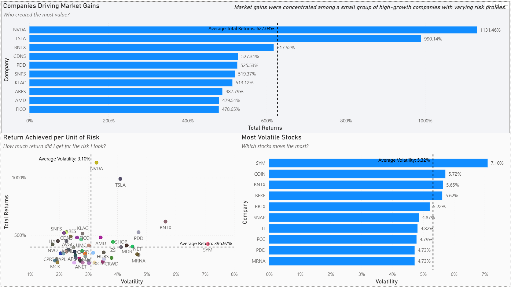

# Financial-Market-Performance-Risk-Analytics
An end-to-end financial analytics project built using Azure SQL and Power BI to evaluate market performance, company returns, and risk-adjusted investment outcomes.

## Project Overview
This project transforms historical equity market data into analytical insights through a structured data pipeline.
Daily trading prices are converted into compounded financial returns and analyzed against volatility to understand how efficiently companies generated performance.
The goal was to simulate a real-world analytics workflow — from raw data ingestion to executive-level dashboard storytelling.

## Business Questions
How has the market performed over time?
When did major performance shifts occur?
Which companies generated the highest returns?
Which stocks exhibited the highest volatility?
Were higher returns associated with higher risk?

## Architecture
Raw CSV Data
      ↓
Azure SQL Database
      ↓
Data Modeling (Fact + Dimension Tables)
      ↓
Metrics Layer (Daily Returns)
      ↓
Analytical Views
      ↓
Power BI Dashboard

## Data Modeling

Warehouse-inspired structure:
dim_company — company attributes
fact_trading — daily market activity
fact_corporate_actions — dividends & splits
Each record represents one company on one trading day.

## Financial Methodology

Daily returns:
(close - previous_close) / previous_close

Returns were aggregated using compounding:
EXP(SUM(LOG(1 + daily_return))) - 1
This ensures realistic long-term performance measurement.

## Dashboard Highlights
Market Overview
Cumulative market growth
Long-term performance trends
Quarterly market behavior
Company & Risk Analysis
Top performing companies
Volatility comparison
Risk vs Return evaluation

## Tech Stack

Azure SQL Database
T-SQL
Power BI
DAX
DBeaver

## Key Insights

Market growth followed cyclical recovery patterns.
Performance was concentrated among a subset of companies.
Higher volatility did not always lead to higher returns.
Risk-adjusted analysis revealed inefficient performers.

## Conclusion
This project demonstrates an end-to-end financial analytics workflow - from cloud database setup and SQL modeling to risk-based performance analysis and interactive visualization.
Rather than focusing solely on tooling, the project emphasizes analytical design, financial correctness, and clear communication of insights.
